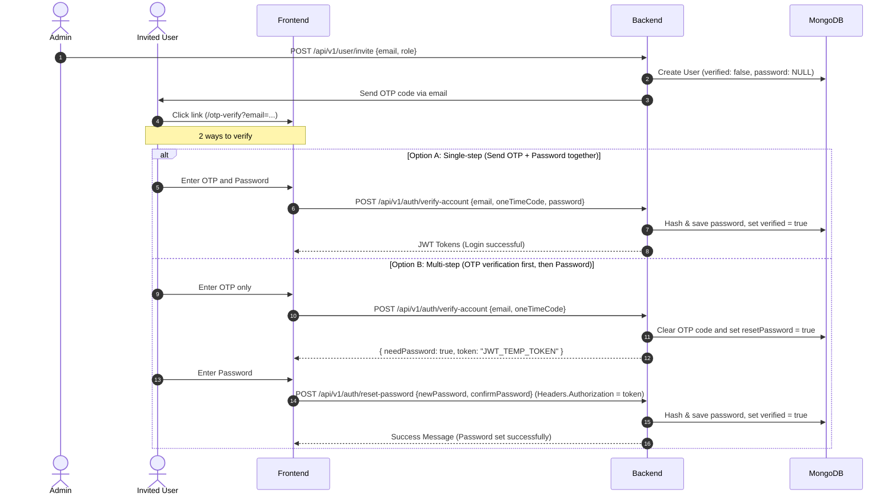

# Invited User Verification & Password Setup Flow

This documentation explains how to complete OTP verification and password setup after a user has been invited.

---

## 1. Flow Overview (Flow Diagram)



---

## 2. API Reference

### 1. User Invitation (By Admin or Super Admin)
* **Endpoint:** `POST /api/v1/user/invite`
* **Headers:** `Authorization: Bearer <ADMIN_ACCESS_TOKEN>`
* **Request Body:**
  ```json
  {
    "email": "mofit85267@hotkev.com",
    "role": "user" 
  }
  ```
* **What it does:** Creates the user in the database with `verified: false` and no `password`. An OTP is then sent to the user's email along with a frontend link (`/otp-verify?email=mofit85267@hotkev.com`).

---

### 2. Account Verification (OTP Verification by User)
* **Endpoint:** `POST /api/v1/auth/verify-account`
* **Request Body (Without password - Multi-step):**
  ```json
  {
    "email": "mofit85267@hotkev.com",
    "oneTimeCode": "123456"
  }
  ```
* **Response (Without password - Multi-step):**
  ```json
  {
    "statusCode": 200,
    "success": true,
    "message": "OTP verified successfully, please set your password to complete your account.",
    "data": {
      "token": "eyJhbGciOi...",
      "needPassword": true
    }
  }
  ```
  > [!IMPORTANT]
  > When the frontend sees `needPassword: true` in the response, it knows the user must set a password and should redirect them to a password input page. At this stage, the `verified` status in the database is still `false`.

* **Request Body (With password - Single-step):**
  If both OTP and password are collected on the same screen in the frontend:
  ```json
  {
    "email": "mofit85267@hotkev.com",
    "oneTimeCode": "123456",
    "password": "mySecurePassword123"
  }
  ```
* **Response (With password - Single-step):**
  ```json
  {
    "statusCode": 200,
    "success": true,
    "message": "Welcome mofit85267 to our platform. Your account is now verified and password set.",
    "data": {
      "accessToken": "ey...",
      "refreshToken": "ey...",
      "role": "user"
    }
  }
  ```
  > [!TIP]
  > When a request is sent with a password, the `verified` field in the database is set directly to `true` and the user receives tokens immediately after being logged in.

---

### 3. Password Setup (If password was not sent during verification)
* **Endpoint:** `POST /api/v1/auth/reset-password`
* **Headers:** `Authorization: <token received from the verify-account API>`
* **Request Body:**
  ```json
  {
    "newPassword": "mySecurePassword123",
    "confirmPassword": "mySecurePassword123"
  }
  ```
* **Response:**
  ```json
  {
    "statusCode": 200,
    "success": true,
    "message": "Password reset successfully, please login now.",
    "data": {
      "message": "Password reset successfully"
    }
  }
  ```
  > [!NOTE]
  > Once this request succeeds, the user's `password` is saved in the database and the `verified` status becomes `true`. The user can then log in normally using their email and new password.
